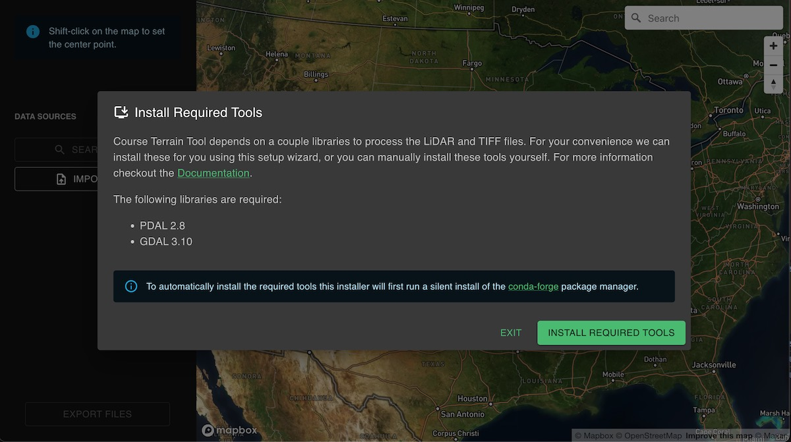
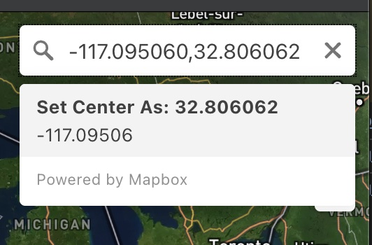

## Getting Started

This Getting Started Guide will walk you through the core features of the Course Terrain Tool (CTT), so you can quickly get up and running.

Start by downloading the latest version from our [releases page](https://github.com/dudewheresmycode/course-terrain-tool/releases/latest).

### Mac Installation
1. Download the `.dmg` file (`Course-Terrain-Tool-x.x.x-universal.dmg`) for the latest [release](https://github.com/dudewheresmycode/course-terrain-tool/releases/latest)
2. Open the `.dmg` file
3. Drag the icon to the Applications folder
4. Open `Course Terrain Tool` from your `Applications` folder

### Windows Installation
1. Download the `.exe` (`Course-Terrain-Tool-Setup-x.x.x.exe`) file for the latest [release](https://github.com/dudewheresmycode/course-terrain-tool/releases/latest)
2. Double-click the `.exe` file
3. Follow the on screen instructions to install `Course Terrain Tool`

### Install Required Tools

The first time you launch CTT, you'll likely be presented with a prompt to install some required tools. We recommend clicking the Install Required Tools and using our built-in installer. But if you have trouble, or prefer to do things manually, you can opt to install the [required libraries](/libraries) yourself. Then simply relaunch CTT and we should detect the tools on your system.

### Setting The Center Point

There's two ways to set the center point on the map.
1. **Shift-Click**: Set the center point on the map by holding shift while left-clicking.
2. **Search Box**: Enter a latitude / longitude in the search box and 
    

### Setting inner/outer

Set your **Inner Area**, and optional **Outer Area** size (in kilometers). Make sure your course fits within the inner box with some extra padding. The square you see on the map is mostly just a guide and we'll do some recalculations of this box later on using the data's native CRS units and it could vary by a few meters.

### Search for Data

Click the **Search Data** button to search our current lidar data sources for data that falls within the bounds of your defined area. This search process isn't perfect and you'll still need to ensure that you have data covering the entire area you want to capture. Overlaps are ok, as we'll be merging the laz data together in a later step, but it's important to make sure you have data covering at least 90% of your inner and outer area.

### Import Data

If data isn't available for your course via search, you can import LAS or LAZ files directly. 

## Setting CRS

A CRS (Coordinate Reference System) is required to be able to process the lidar data. We do our best to automatically detect the CRS of the data when you search or import data, but we can't always determine the CRS automatically. In those cases, you'll need to try and track down the CRS manually. Try looking for files that describe the metadata of the data set. If you have trouble, ask in the Discord channel.